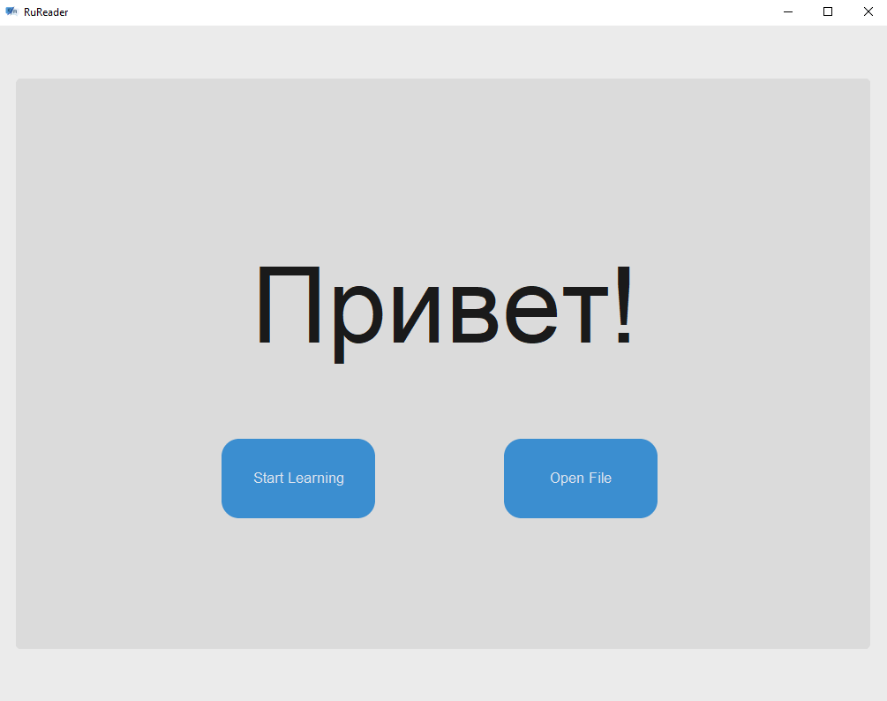
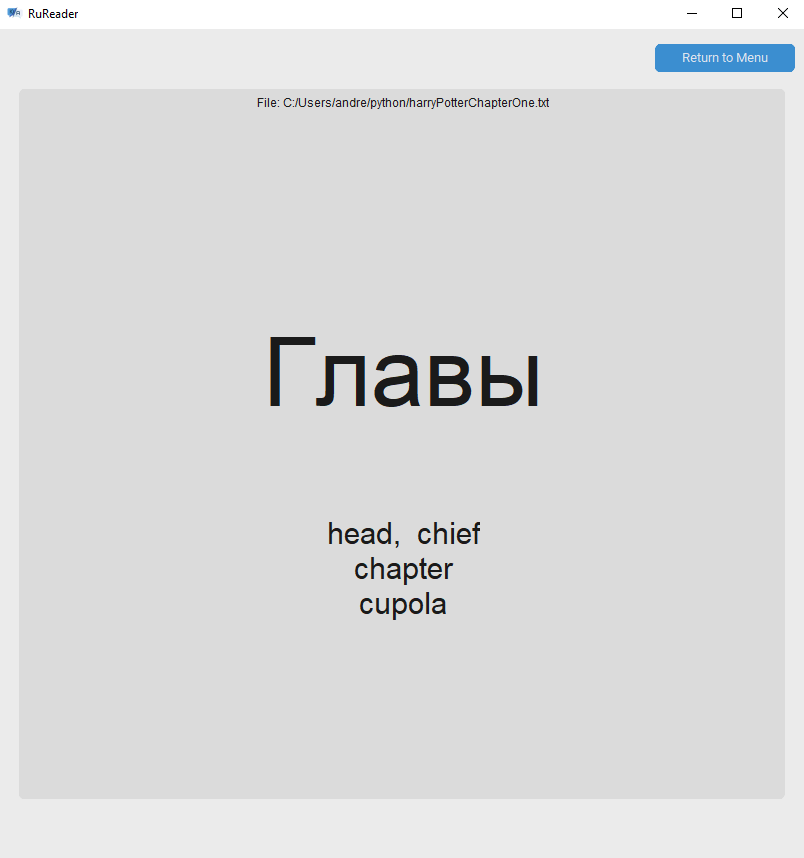
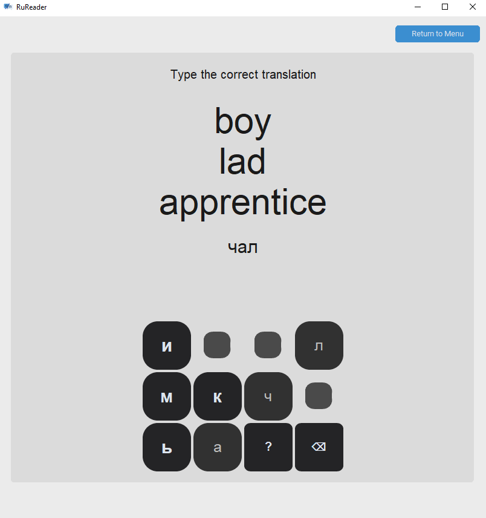

<!-- Improved compatibility of back to top link: See: https://github.com/othneildrew/Best-README-Template/pull/73 -->

<!--
*** Thanks for checking out the Best-README-Template. If you have a suggestion
*** that would make this better, please fork the repo and create a pull request
*** or simply open an issue with the tag "enhancement".
*** Don't forget to give the project a star!
*** Thanks again! Now go create something AMAZING! :D
-->

<!-- PROJECT SHIELDS -->
<!--
*** I'm using markdown "reference style" links for readability.
*** Reference links are enclosed in brackets [ ] instead of parentheses ( ).
*** See the bottom of this document for the declaration of the reference variables
*** for contributors-url, forks-url, etc. This is an optional, concise syntax you may use.
*** https://www.markdownguide.org/basic-syntax/#reference-style-links
-->
[![MIT License][license-shield]][license-url]
[![LinkedIn][linkedin-shield]][linkedin-url]

<!-- PROJECT LOGO -->
 

  

<h3 align="center">RuReader</h3>

  

    A program for efficiently reading Russian text while increasing vocabulary!
     
  

<!-- TABLE OF CONTENTS -->

  
Table of Contents

  <ol>
    <li>
      <a href="#about-the-project">About The Project</a>
      <ul>
        <li><a href="#built-with">Built With</a></li>
      </ul>
    </li>
    <li><a href="#roadmap">Roadmap</a></li>
    <li><a href="#contributing">Contributing</a></li>
    <li><a href="#license">License</a></li>
    <li><a href="#contact">Contact</a></li>
  </ol>

<!-- ABOUT THE PROJECT -->
## About The Project
 

  
 
 

There is a gap when learning to read a language where low level books are too easy and real books you want to read have too many unknown words. I created this program to solve this issue in a format that worked for me.

Features

* Rapid Serial Visual Presentation (Single Word Reading)
* Offline Dictionary Translation Using Lemmatization
* Reinforcement Word Games
* Save Known and Unknown Words

 

  
&nbsp; &nbsp; &nbsp; &nbsp;
  

(<a href="#readme-top">back to top</a>)

### Built With

* [![Python]][Python-url]
* [![CustomTkinter]][CustomTkinter-url]

(<a href="#readme-top">back to top</a>)

<!-- USAGE EXAMPLES -->
## Usage

To progress through texts in the reading feature, the user must left click (Mouse 1) if they know the word and right click (Mouse 2) if they do not. Right clicking will then reveal the translation(s) of the word and another click is needed to proceed to the next word. Left clicking will bypass the showing of the translation and simply move onto the next word. The scroll wheel can also be used to quickly move backwards or forwards in the book.

(<a href="#readme-top">back to top</a>)

<!-- ROADMAP -->
## Roadmap

- [ ] Review Words Interface
	* Complete the area to review words in your unknown/known list and their respective defintions
- [ ] Online Book Integration
	* Introduce a method for importing online articles, texts, etc. rather than raw .txt files
- [ ] Web App
	* Completely port the application for browser use

See the [open issues](https://github.com/andrewherndon/RuReader/issues) for a full list of proposed features (and known issues).

(<a href="#readme-top">back to top</a>)

<!-- CONTRIBUTING -->
## Contributing

Contributions are what make the open source community such an amazing place to learn, inspire, and create. Any contributions you make are **greatly appreciated**.

If you have a suggestion that would make this better, please fork the repo and create a pull request. You can also simply open an issue with the tag "enhancement".
Don't forget to give the project a star! Thanks again!

1. Fork the Project
2. Create your Feature Branch (`git checkout -b feature/AmazingFeature`)
3. Commit your Changes (`git commit -m 'Add some AmazingFeature'`)
4. Push to the Branch (`git push origin feature/AmazingFeature`)
5. Open a Pull Request

(<a href="#readme-top">back to top</a>)

<!-- LICENSE -->
## License

Distributed under the MIT License. See `LICENSE.txt` for more information.

(<a href="#readme-top">back to top</a>)

<!-- CONTACT -->
## Contact

Andrew Herndon - https://www.linkedin.com/in/andrew-herndon-607304292/

Project Link: [https://github.com/andrewherndon/RuReader](https://github.com/andrewherndon/RuReader)

(<a href="#readme-top">back to top</a>)

<!-- MARKDOWN LINKS & IMAGES -->
<!-- https://www.markdownguide.org/basic-syntax/#reference-style-links -->
[license-shield]: https://img.shields.io/github/license/andrewherndon/RuReader.svg?style=for-the-badge
[license-url]: https://github.com/andrewherndon/RuReader/blob/main/LICENSE.txt
[linkedin-shield]: https://img.shields.io/badge/-LinkedIn-black.svg?style=for-the-badge&logo=linkedin&colorB=555
[linkedin-url]: https://www.linkedin.com/in/andrew-herndon-607304292/
[Python]:
https://img.shields.io/badge/python-3670A0?style=for-the-badge&logo=python&logoColor=ffdd54
[Python-url]: https://www.python.org
[CustomTkinter]:
https://img.shields.io/badge/CustomTkinter-gray?style=for-the-badge&logo=data:image/png;base64,iVBORw0KGgoAAAANSUhEUgAAACAAAAAgCAYAAABzenr0AAAAAXNSR0IArs4c6QAAAARnQU1BAACxjwv8YQUAAAAJcEhZcwAADsMAAA7DAcdvqGQAAAN0SURBVFhH7VdLaFRJFD233utOQvwEZ3BUUEQEBRdRZFxKJKtxK4gLFV0YXAlBF64EkaCbIeDG2C6GDCKzms3ArJTJMC4URFDwD8ZvK34iirG7X17VnXtfVT7ETn8w7SoHHv3u7Xp1zq1b9d69hNk4V+mmONdHBr0EXgcyufBPY2AHlD8Dn96An96Fe1tMEMWPQdEVmauAPw7cDiMzTAv49VkHLV45SCY6JG4TvN8EE4meB9dgn9wXI1aXA3MBeduP4YNldXgBSr5oxd8U5Xoyex5hjIP9709wkgQRDNhkBDn7i4rwkXYuH2wFuYLZgH5c5Q2SeFVE1NaDNB7MXDj7udt0tN+UHM3LslcDP7wGfvlYiPM+L7oKaeKQVrYY5OO+VpIr+MMbH/3UJXRRbBBFfYZgesO4FoDBL2QDjn/0pEqeIYgA9RINVRKK840dNTli7KzVO++oBkk6w6A8Lsv+AHj5KORdKEiWf1KIk2nSUkJ0PmHZgOHhOeDsuGM3gIn0EnJ3iyhunVvAq7/yeDu6HSZ3Grn2zYjbvQDN/dQqTAooi1lPALtxCboHh/M3gqcx7P29E6n7F7m2rdnmm0muCAI0EXVAA02TKy7ulxzwMW8I6UzyKcgODHfVIeMd4VKwmsfGtVdlP1S8MZvco6YAYrawVAxm8zi5I5UcBgHVUW8FGMVaO/7b0cAeaC0WBCwI+B4Cqr8AAuoJiLCaO8J989g3/IPwd9aSUFMAy/szH2NHMJuHpT0yhX4dBdVfJ7VXQJ6xDmfwG3cFT+PYVdgE5055QyZiFTBbhIbYwOeYDN+Tmul4kuIfPKdScFfHnaGfYO1uqXZOIO7oQqxlWK3PcaMFiTwjb2YNQQuSucGspS9Qkd5AChJfksv0kbirFCSaAqkWG0C2iiTfJ4prXpLV7GpbAqz/GfGmbUI24QmzFGQT+V/Ho0ZKrCs6fyugTRJWbgAtWuqNjFihIsQmvmwkDwW2Ezq0JXDCRV3LA7kSB3KbSsdiCwZHlt3iNLkwrW6ekfGF+KbJ5TfN+kR/DMtj/W6iNNISEULO70JNo/M7IbeVEcRpv7q8gKNrSii93+mSL+fnNR0SrXt43XfLWeTaDSVDk32hDvn6JXl2rFtKaWnPI21YpD2n+kd0JjRKJfwo7bk2JWOvpT2PRkHxZTmCs9pz4H+va4Gb9Ojw+gAAAABJRU5ErkJggg==
[CustomTkinter-url]:
https://customtkinter.tomschimansky.com/

